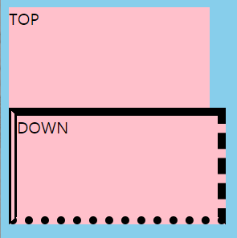

## 박스(Box) 모델
: HTML의 모든 요소는 Box의 형태를 갖는다.
- 장점\
: 컨텐츠를 테트리스처럼 조밀하게 배치할 수 있다.\
: 박스의 크기를 계싼해 쉽게 브라우저로 출력할 수 있다.
### box 모델의 구성
: 박스 형태 전체를 가리킨다.
#### 1. 내용(Content)
: 이미지나 텍스트와 같이 우리가 코드 상에서 태그 사이에 담은 내용, __실제로 담고 있는 부분__
#### 2. 패딩(Padding)
: 컨텐츠와 경계선 사이의 여백
#### 3. 경계선(Border)
: 말 그래도 컨텐츠를 감싹 있는 테두리
#### 4. 마진(Margin)
: 경계선 밖의 여백


## 내용(Content)
: 보통 요소의 크기를 정의할 때 width나 height를 많이 사용하는데, 이런 너비와 크기는 box model 중 content의 크기에 해당한다.
``` css
#inner {
    background-color: pink;
    width: 200px;
    height: 100px;
}
```
> 컨텐츠 영역의 크기가 지정되어 있는 상태에서 컨텐츠의 크기를 늘리면 내용이 컨텐츠 박스를 벗어나게 된다.
>> 컨텐츠 박스를 기준으로 배치된다.(마진, 패딩 등이 없는 경우)

## 경계선(Border)
: 경계선을 크게 세 프로퍼티인 border-style, border-width, border-color를 이용한다.
### border-style
: 선의 스타일, 선의 종류를 지정하는 프로퍼티.
```
border-style: none | hidden | dotted | dashed | solid | double | groove | ridge | inset | outset | initial | inherit
```
> 여러 종류가 있다.
#### 가장 많이 쓰이는 스타일
1. 실선(solid)
2. 파선(dashed)
3. 점선(dotted)
4. 이중선(double)
``` css
#target {
    border-color: black;
    border-style: solid dashed dotted double;
    /* top right bottom left 순서로 스타일을 지정*/
    border-width: 8px;
}
```


#### 방향을 지정하는 프로퍼티 함께 사용하기
``` css
border-top-style: solid; /* 상 */
border-style: solid; /* 상하좌우 */
border-style: solid dashed; /* 상하/좌우 */
border-style: solid dashed dotted; /* 상/좌우/하 */
border-style: solid dashed dotted double; /* 상/우/하/좌 */
```

### border-width와 border-color
: 선의 두께와 색을 지정하며, __border-style 없이 지정했을 땐 적용되지 않는다.__
``` css
#target {
	border-style: dotted;
	border-color: black red yellow blue;
	border-width: 8px 4px 16px 24px;
}
```


### border의 shortcut
: Shortcut을 이용해 한 번에 지정할 수 있다.\
=> border 전체의 설정을 한 번에 지정이 가능하다.
``` css
border: red solid 1px;
border-bottom: red solid 2px;
```
> 한 면에만 선을 지정하고 싶을 경우, ```border-bottom```이런식으로 지정해주기!

### border-radius
: border로 만든 경계선을 둥글게 표현할 때 사용\
: border-radius의 값은 __모서리의 반지름 값이다.!__\
👩‍🏫 border가 없어도 적용이 가능한데, __테두리 존재 여부와 별개로 전체 background에 적용하기 때문__ 이다!\
> 원을 만들고 싶거나, 모서리가 둥근 사각형을 만들고 싶다면? border 없이 border-radius 이용하기~
#### border-radius와 shortcut
: 한 번에 지정하거나, 네 방향으로 나누어서 부분적으로 적용이 가능하다!


### 꿀팁
#### 1. CSS에서의 방향
: 상,우,하,좌 순서로 적용되고, 값을 지정해주는 개수에 따라 스타일 적용 위치도 변경된다.
#### 2. 타원형의 radius 적용 가능
: 가로 반지름을 먼저 적고, 세로 반지름이 그 다음에 따라온다.
``` css
.radius {
    border-top-left-radius: 24px 12px;
}
```
👩‍🏫 네 모서리에 모두 적용하고 싶을때는, __/로 구분하여 차례대로 작성한다__
``` css
border-radius: 가로 반지름 / 세로 반지름;
```
``` css
.radius {
    border-radius: 8px 16px 24px 36px / 36px 24px 16px 8px;
}
```


## 패딩(Padding)
: border를 기준으로 경계선 내부 여백
``` css
margin: 12px 24px 32px 63px;
/* 상 우 하 좌 */
```
## 마진(Margin)
: border를 기준으로 경계선 외부 여백
``` css
padding: 12px 24px 32px 63px;
/* 상 우 하 좌 */
```

### 패딩과 마진 실습
``` html
<div class="box">
	<div class="inner">
		content
	</div>
</div>
```
``` css
body { background: skyblue;}
.inner {
	background: lemonchiffon;
	width: 100%;
	height: 100%;
}
.box {
	display: inline-block;
	background: pink;
	width: 100px;
	height: 100px;
	border: 8px solid red;
	margin: 20px;
	padding: 20px;
}
```


### 마진 상쇄
: 위아래로 맞닿은 두 요소 사이 마진은 더 큰 쪽으로 기준으로 결정된다.
> 두 요소에 각각 마진을 적용하더라도 서로 맞닿아 있다면 마진이 따로 존재하지 않는다는 말과 동일


> 중간에 화살표가 20px+20px이 아니라 20px만 적용되어있다.
``` css
body { background: skyblue;}
.box {
	display: inline-box;
	width: 100px;
	height: 100px;
}
#top{
	background: pink;
	margin-bottom: 20px;
}
#bottom {
	background: lemonchiffon;
	margin-top: 40px;
}
```
: 내가 생각한대로 여백이 생기지 않으면, 마진 상쇄 문제가 아닌지 고민해보기!

## box-sizing
: 일반적으로 요소에 width나 height를 적용하면, 항상 content의 크기가 조정된다. 때문에 다른 요소들과 배치할 때 종종 크기 값을 어떻게 줘야 할지 고민할 때가 많다.
> 예시로, 두개의 box가 서로 붙어있을 때, 한 박스를 padding과 border로 꾸미려고 코드를 수정하면, 예상한 것과 달리 두개가 분리되어 버린다.

: 이러한 고민들을 위해 box-sizing 프로퍼티를 이용하자!
``` css
box-sizing: content-box;
/* content-box를 기준으로 크기를 정한다. */
/* width(height) = content size */
box-sizing: border-box;
/* border 바로 전 padding까지의 기준으로 크기를 정한다. */
/* width(height) = content size + padding + border size */
```

👩‍🏫 정리하면, 기본 값은 content-box의 width 값은 컨텐츠만의 사이즈이고, border-box는 컨텐츠의 크기와 패딩까지 합한 값이라는 것!

- content-box\
: padding 값을 줄 경우 배경이 넓어진 것처럼, 내부 여백이지만 밖으로 펼쳐 나가는 모습을 보인다.
- border-box\
: width가 padding을 포함하기 때문에 자동으로 컨텐츠의 크기가 줄어든다. 내부 여백인 패딩에 값을 주면 컨텐츠가 줄어 안으로 여백이 확장되는 것처럼 보인다.
