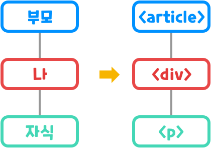

## CSS(Cascading Style Sheets)란?
: 웹에 적용할 스타일을 적어둔 일종의 스타일 명세서
### 스타일 시트
: CSS는 웹 페이지의 스타일, 즉 디자인을 정의하여 정리한 문서
> 웹 페이지의 색, 글자크기 및 폰트, 구성 요소 배치 등
### 캐스캐이딩(Cascading)
: CSS에 적혀있는 스타일을 우선순위에 따라 순차적으로 화면에 적용.

### CSS의 기본 구조
#### 1. 선택자(Selector)
: HTML의 태그를 가리키고 있는 것을 말한다.\
: 스타일을 지정할 특정 HTML 요소를 선택하는 역할.

#### 2. 속성(Property)
: 지정 또는 변경하고 싶은 스타일 속성의 이름.
> html은 attributes css는 property.

: font-size, color, background, position 등 다양한 요소 사용 가능.

#### 3. 값(Value)
: 프로퍼티와 짝을 이루어 사용.
- CSS에 정의된 특정 키워드(blue, block 등)
- 수치와 특정 단위(px, %, em, rem, vh, vw 등)
``` css
article { /* article : 선택자(<article> 태그를 가리킴.) */
    font-family: '맑음 고딕';
    font-size: 16px; /* font-size : 속성, 16px : 값 */
    color: blue;
}
```

#### 4. 선언 블록 (Declaration Block)
: 선택자 뒤에 위치한 {} 안의 한 블록
> 프로퍼티와 값의 짝 : 선언(Declaration)이라고 부름.

: 선언 블록 내부의 다른 선언과 ;로 구분.\
: ,로 선택자 여러 개의 스타일을 한꺼번에 지정 가능.
``` css
h1, p {
    font-family: '맑음 고딕';
    color: blue;
}
```

### CSS의 기본 단위
: CSS의 값 자리에는 다양한 것이 들어갈 수 있음.
### 크기 단위
#### 1.고정 크기 단위 (절대 길이)
: px(픽셀), pt(포인트), in(인치), cm, mm
> 픽셀은 디스플레이를 구성하는 최소 단위
#### 2.가변 크기 단위
- em, rem (반응형 웹 만들기 위해 사용.)
: em = 현재 스타일이 지정되는 요소의 폰트 크기 기준
> 상위 요소 font-size에 영향을 받음.
: rem = 최상위 요소(```<html>```태그)의 폰트 크기 기준
> html에 지정된 폰트가 상속을 통해 아래의 요소들의 폰트 크기를 바꾸기 떄문에 가능.
- %(퍼센트)
: 이미지나 레이아웃의 너비나 높이를 지정할 때 자주 쓰임.
``` css
html {
background-color: skyblue;
font-size: 32px;
}
#main { /* html의 50% 너비만큼 가짐 */
background-color:bisque;
width: 50%;
}
#per { /* #main을 기준으로 50% 너비만큼 가짐 */
background-color: blue;
width: 50%;
}
```
> 너비, 높이, 폰트 크기 등 각각의 프로퍼티 값의 상대적인 값을 가짐.

### 색상
#### 1. 키워드
: 내부적으로 지정되어 있는 키워드를 쓰면 쉽게 색 지정 가능.
``` css
.box {
	width: 200px; 
	height: 100px;
    background-color: blue;
}
```
#### 2. rgb
: 빛의 3원색은 빨, 초, 파를 혼합해 색을 표현하는 방식.
> RGB 값은 0 ~ 255
``` css
.box {
	width: 200px; 
	height: 100px;
    background-color: rgb(102, 205,170)
}
```
#### 3. hex code
: 16진수 6자리 코드로 색상을 표현.
> 2/2/2 : 빨/초/파
``` css
.box {
	width: 200px; 
	height: 100px;
	background-color: #F08080; 
}
```
### Alpha(투명도)
: rgb와 hex code에서 사용 가능.
- rgb
: rgba 사용\
: 0~1사이 숫자로 표현(0% ~ 100%)
``` css
.box {
	width: 200px; 
	height: 100px;
	background-color: rgba(102, 205, 170, 0.5); 
}
```
- hex code
: 6자리에 2자리 추가\
: 00~FF사이의 16진수 숫자로 결정(0% ~ 100%)
``` css
.box {
	width: 200px; 
	height: 100px;
	background-color: #F0808055;
}
```

## 선택자(Selector)
### 1. 단순 선택자
#### 타입 선택자(Type Selector)
: 해당 태그를 가지는 모든 요소에 스타일을 적용.
``` css
p {
	color: red;
}
```
> ```<p>``` 태그를 가지는 모든 요소에 적용.
#### 아이디 선택자(Id Selector)
: HTML의 아이디 이름으로 스타일을 적용.
``` html
<p id = "woo">피에스타 내 맘에 태양을 꾹 삼킨채</p>
```
``` css
#woo {
	background-color: pink;
}
```
#### 클래스 선택자(Class Selector)
: HTML의 클래스 속성을 선택자로 사용해 스타일을 적용.
``` css
.mafia {
	color: white;
	background-color: black;
}
.citizen {
	color: white;
	background-color: green;
}
```
> 비슷한 스타일을 묶어 스타일을 적용시키고 싶을 때 많이 사용.
#### 전체 선택자(Universal Selector)
: 모든 요소에 스타일을 적용.
> 속도가 저하될 수 있어 쓰지 않기를 권장.
``` css
* {
	color: yellow;
}
```
#### 속성 선택자(Attribute Selector)
: 특정 HTML 속성을 가지고 있는 모든 요소에 스타일을 적용.\
: 속성 선택자를 사용하고 싶으면 선택자 오른쪽에 []로 속성과 속성값을 넣으면된다.
```css
선택자[속성명="속성값"] {
	color: red;
}
```
``` css
a[target="_blank"] {
	color: red;
}
.link[target="_blank"] {
	color: red;
}
```
### 2. 복합 선택자
: 선택자를 2개 사용한다.(?)
#### 🍯꿀팁)) 부모-자식-후손 요소
: 부모-자식 관계는 상대적\
: 자식 요소와 그 아래에 포함된 모든 태그들을 아울러 후손 요소라고 부른다.
> 부모 아래 모든 하위 요소들은 후손 요소인 셈.


#### 자식 선택자(Child Selector)
: 선택자 A의 모든 잣기 중 선택자 B와 일치하는 요소를 선택한다.\
: 선택자를 두 개 사용하기 때문에 __>를 써주자!__
``` css
선택자A > 선택자B {
	color: green;
}
```
> 선택자A 밑에 선택자C 밑에 있는 선택자B일 경우 초록색으로 변하지 않는다.
>> 주의!!

#### 후손 선택자(Descendant Selector)
: 선택자 A의 모든 후손 중 선택자 B와 일치하는 요소를 선택한다.\
: 선택자를 두 개 사용하기 때문에 __띄어쓰기를 써주자!__
``` css
선택자A 선택자B {
	background-color: yellow;
}
```
> 선택자A 밑에 선택자C 밑에 있는 선택자B일 경우에도 배경색이 노란색으로 변한다.
>> 자식 선택자와 다른점!

### 3. 가상 클래스 선택자
: 요소의 특별한 상태를 정의하는데 사용한다.
#### 가상 클래스(Pseudo-class)란?
: 스타일을 지정할 때 쓰인다는 점에서는 클래스와 비슷하다.\
=> but 클래스와 달리 가상 클래스는 직접 정의X, 실제 HTML에 보이지 X.\
: __선택자에 가상 클래스를 붙여 가상 클래스 선택자로 이용한다.__
``` css
선택자:pseudo-class{
	color: blue
}
```
#### 링크 태그와 관련된 가상 클래스 (대표적)
1. a:link\
: 방문하지 않은 링크일 때
2. a:visited\
: 방문한 링크일 때
> 클릭 후 다시 돌아왔을 때!
3. a:hover\
: 링크에 마우스를 올렸을 때
4. a:active\
: 선택된 링크일 때\
=> 링크 태그를 선택할 때 스타일을 정의한다.
> 클릭 했을 경우에 바뀐다.