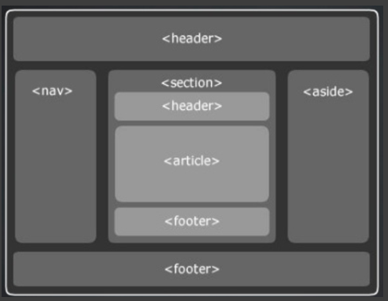

## 1교시
## HTML 심화
### 웹
#### 1. HTML
: 내용, 요소들을 정의해주고
#### 2. CSS
: 디자인, 스타일을 먹여준다.
#### 3. JavaScript
: 동적으로 표현해줄 수 있는 친구.
#### 4. Python
: 화면 구성 후, 여러가지 기능들을 구현한다.

### 브라우저란?
: 웹 서버에 접속해서 웹 페이지, 이미지, 동영상, 음악 등 다양한 ~~.\
~> url에 내용을 써서 요청을 하고, 요청을 받고 받은 요청을 화면에 보여주는 소프트웨어

### 웹이 돌아가는 과정
: client가 browser를 통해서 web server에 요청을 하면, 서버에 저장되어있던 파일들이 우리에게 보여지는 것!
``` html
<!DOCTYPE html>
<html lang="en">
<head> <!--화면에 나오지 않는 것들-->
    <meta charset="UTF-8">
    <meta name="viewport" content="width=device-width, initial-scale=1.0">
    <title>Document</title>
</head>
<body>
    <h1>하이</h1> <!--열고 닫는 친구-->
     <!--이 친구는 안닫아도 괜춘!-->
    <!--img은 태그, src는 속성, 속성안에 속성값을 넣어준다!-->
</body>
</html>
```

### 개발자 도구 (chrome F12)
: 여기서 이것 저것 수정해볼 수는 있지만, 내 코드에서는 바뀌지 않는다.


### 실습
#### Form
: 정보를 전해주기 위한 것!\
: submit을 이용해서 제출하면 정보가 전송이 된다!
#### Form method
: 전송 방법에 따라서 url에 나타나고 안나타나고가 결정!\
: get 방식은 나타나고, post 방식은 안나타난다!
#### section
: 시멘틱 태그\
: html5부터 지원해주었다.\
> 예전에는 div 태그를 이용해서 name을 section으로 해주면서 나눴는데 이젠 section 자체를 이용하면 된다.


## 2교시
## CSS 기초
### CSS와 HTML 연결시키기
#### 인라인 요소로 선언
: 하나의 태그에만 선언하기 때문에 다른 h1에서는 바뀌지 않는다.
``` html
<body>
    <h1 style="font-size: 20px;">안녕</h1>
</body>
```
#### style 속성 활용하기
: 길어지면 너무 힘들다.
``` html
<head>
    <style>
        h2{
            color: red;
        }
    </style>
</head>
<body>
    <h2>안늉</h2>
</body>
```
#### CSS 외부 참조 (이걸 사용하자🙋‍♀️)
``` html
<head>
    <link rel="stylesheet" type="text/css" href="./insta.css">
</head>
```
### class와 id
: 태그 < 클래스 선택자 < id 선택자
#### class
: 여러 태그에 사용 가능, 재사용도 가능!
``` css
.mydiv {
    color: green;
}
```
#### id
: 한 가지 id 값을 가져야한다! unique! 고유하게!
> 여러 태그에 사용 X, 재사용 X.
``` css
#first {
    border: 2px solid purple;
}
```
__👩‍🏫class 선택자를 먼저 사용하고, css가 먹히지 않으면 id 선택자를 사용해주는 것 추천!__

### 인스타그램 클론 코딩하기
#### border를 이용해서 구분해서 보기!


#### position 속성
``` css
.profile-box{
    border:2px solid red;
    position: relative; /* 기준을 잡아준다. 어디로부터~ 라고 할 때 어디로부터!*/
}

.ac-info{
    position: absolute; /* 절대적으로 어느 위치에 있게 하고 싶다는 것을 선언해주기*/
}
```

### 🍯꿀팁
#### 1. 사용가능한가 체크할때는?
https://caniuse.com/
#### 2. 단위
: %를 사용하면 브라우저의 크기에 따라 바뀐다!\
: 섞어 사용하지 말고, 하나 정해서 사용하는게 좋다! 혼용시 복잡쓰!!!
> px 사용하면 고정!
>> 16px = 1rem

