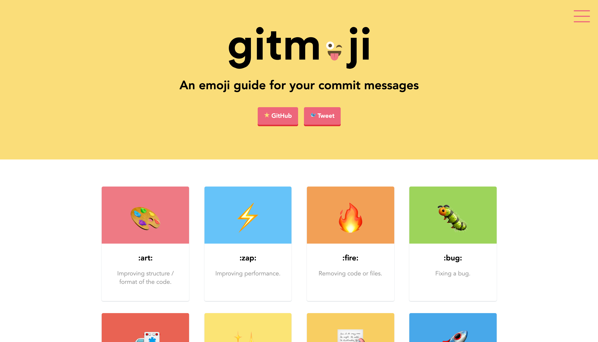

## 좋은 git 커밋 메시지를 작성하기 위한 8가지 방법.
1. 제목과 본문을 한 줄 띄워 분리하기
2. 제목은 영문 기준 50자 이내로
3. 제목 첫글자를 대문자로
4. 제목 끝에 . 금지
5. 제목은 명령조로
6. Github - 제목(이나 본문)에 이슈 번호 붙이기
7. 본문은 영문 기준 72자마다 줄 바꾸기
8. 본문은 어떻게보다 무엇을, 왜에 맞춰 작성하기

## 타입의 종류
- ```feat```: (new feature for the user, not a new feature for build script)
> 빌드 스크립트의 새 기능이 아닌 사용자를 위한 새 기능
- ```fix```: (bug fix for the user, not a fix to a build script)
> 빌드 스크립트에 대한 수정이 아닌 사용자를 위한 버그 수정
- ```docs```: (changes to the documentation)
> 문서의 변경 사항
- ```style```: (formatting, missing semi colons, etc; no production code change)
> 포맷, 세미콜론 누락 등, 생산 코드 변경 없음
- ```refactor```: (refactoring production code, eg. renaming a variable)
> 생산 코드 리팩토링 (예: 변수 이름 변경)
- ```test```: (adding missing tests, refactoring tests; no production code change)
> 누락된 테스트 추가, 리팩터링 테스트, 생산 코드 변경 없음
- ```chore```: (updating grunt tasks etc; no production code change)
> 스턴트 작업 업데이트 등, 프로덕션 코드 변경 없음

# gitmoji
<a href="https://gitmoji.carloscuesta.me/"></a>

### 타입 대신 이모지로 대신한다.
```
feat: 로그인 기능 구현 완료 // Semantic Commit Messages
✨ 로그인 기능 구현 완료 // gitmoji
refactor: 복잡성을 줄이기 위해 로그인 기능 리팩토링 // Semantic Commit Messages
♻️ 복잡성을 줄이기 위해 로그인 기능 리팩토링 // gitmoji
```

## git 커밋 메시지를 잘 쓰려고 노력해야 하는 이유.
1. 더 좋은 커밋 로그 가독성
2. 더 나은 협업과 리뷰 프로세스
3. 더 쉬운 코드 유지보수