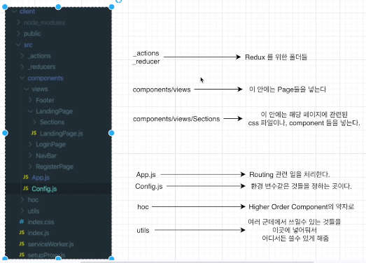
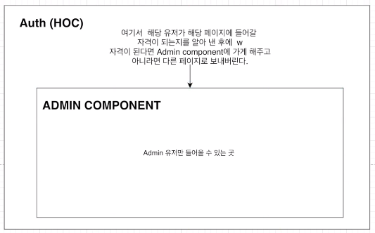
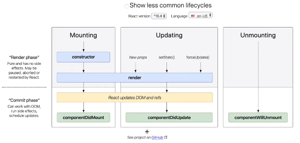

## React JS ?
: 자바스크립트 라이브러리
1. 컴포넌트로 이루어져 있어 module과 비슷하게 재사용성이 뛰어나다.
2. virtual DOM\
: update 된 부분만 바꿔주면 된다!
> Real DOM은 전체를 바꿔주어야한다.
### virtual DOM
: 어떻게 update 된 부분만 바꿔줄 수 있나?
1. JSX을 렌더링 한다.\
: 그러면 virtual DOM이 update 된다.
2. Virtual DOM이 이전 virtual DOM에서 찍어둔 snapshot과 비교해 바뀐 부분을 찾는다.
3. Virtual DOM이 이전 Virtual DOM에서 찍어둔 snapshot과 비교해서 바뀐 부분을 찾는다.
> diffing이라고 부름
4. 그 바뀐 부분만 Real DOM에서 바꿔준다.

### Create React App으로 리액트 시작하기
: 원래 리액트 앱을 처음 실행 하기 위해서는 webpack이나 babel 같은 것을 설정하는데 시간이 많이 걸렸다.\
=> 하지만, 이제는 create-react-app이라는 command로 바로 시작이 가능하다.
#### Babel?
: 최신 자바스크립트 문법을 지원하지 않는 브라우저를 위해, 최신 자바스크립트 문법을 구형 브라우저에서도 돌수있게 변환 시켜주는 역할. (ES5문법)
#### Webpack?
: 웹사이트를 만들 때, 라이브러리와 프레임워크를 많이 쓰다보니 복잡해졌다. 이렇게 복잡해진 것ㄷ르을 webpack을 이용해서 bundle 시켜줄 수 있다.\
=> 많은 모듈들을 합해서 간단하게 만들어준다고 생각하면 된다.
> bundle : 묶어주는 역할이라고 생각하기

#### 리액트 적용해보기
1. ```npx create-react-app .```
> .은 지금 폴더안에 설치하겠다는 소리!
>> ```npm install -g create-react-app```을 이용해서 예전에는 global 디렉토리에 다운을 받았었는데, 이제는 npx를 이용해 다운 받지 않고 사용이 가능하다!


## 🍯꿀팁
### NPM VS NPX
#### NPM(Node package manager)
1. registry라는 저장소 역할을 한다.
2. 어플리케이션을 킬 때나 빌드해서 배포할 때 사용한다.
> npm에 관한 것은 package.json에 정의가 되어있으니 참고하기!
- ```npm install```\
: local로 다운\
: node_modules라는 폴더에 다운받아진다.
> 프로젝트 안에만 다운로드
- ```npm install -g```\
: global로 다운\
: 컴퓨터 안에 ```%AooData%/npm```이 곳에 다운받아진다.
> Disk space 낭비
#### NPX
: npx를 이용해서 그냥 create-react-app을 이용할 수 있다.
> 다운 X.

- HOW?\
: npx가 npm registry에서 create-react-app을 찾아서 다운로드 없이 실행 시켜주기 때문!

- 장점?\
: disk space 낭비 X.\
: 항상 최신 버전 사용 가능.

### Create React App 구조
: 처음에 react를 실행하면(```npm run start```), App.js가 렌더링된다.
> index.js에 App.js라는 컴포넌트가 들어가있기 때문에
``` js
ReactDOM.render(
  <React.StrictMode>
    <App />
  </React.StrictMode>,
  document.getElementById('root') // index.html에 있는 id가 root라고 되어있는 element를 App.js 컴포넌트라고 정의해준것.
);
```
> default로 root이라고 해줌.
#### src
: 이 부분은 webpack이 관리
> 그래서 넣고 싶은 이미지 같은 것들은 여기에 넣어줘야 적용이 가능하다.
#### public
: webpack 관리 X.\
=> 여기에 쓰인 파일은 오직 public/index.html만 쓰일 수 있다.

## Boiler Plate에 특성화된 구조 설정하기
### 원래 Create React App 구조
```
my-app/
  README.md
  node_modules/
  package.json
  public/
    index.html
    favicon.ico
  src/
    App.css
    App.js
    App.test.js
    index.css
    index.js
    logo.svg
```
### Boiler Plate에 특성화된 구조
: src 폴더 부분을 많이 바꾼다.



### HOC
: 다른 컴포넌트를 갖는 함수이다.\
: 자동적으로 HOC가 자격(예시)을 판단해서 다음 액션을 취할 수 있도록 해준다.
> 자격말구 다른 것도 가능하다.
``` js
const EnhancedComponent = higherOrderComponent(WrappedComponent);
```


### 🍯꿀팁
#### 1. ES7 React/Redux/GraphQL/React-Native snippets 확장
- rce : class component 생성
- rafce : allow function component 생성
- rfce : function component 생성

### React Router DOM
: 페이지간의 이동을 할 때 사용한다.\
: https://reacttraining.com/react-router/web/example/basic

## React vs React Hooks
### React Component
#### Class Component
: 더 많은 기능 사용 가능.\
: 코드가 좀 더 길고, 복잡하다.\
: 성능적인면에서 조금 느리다.
``` js
import React, { Component } from 'react';

export default class Hello extends Component {
  render() {
    return (
      <div>
        I want bubble tea!
      </div>
    )
  }
}
```

#### Functional Component
: 제공하는 기능들이 한정적이다.\
: 코드가 짧고, 간단하다.\
: 성능적인면에서 class component보다 빠르다.
``` js
import React from 'react';

export default function Hello() {
  return (
    <div>
      I want bubble tea!
    </div>
  )
}
```

#### lifecycle
: class component에서는 되고, functional component에서는 되지 않았던 기능.


### Hooks의 등장
: functional component에서도 이러한 기능을 쓸 수 있게 되었다!
- Class
``` js
import React, { Component } from 'react';
import Axios from 'axios';

export default class Hello extends Component {
  constructor(props) {
    super(props);
    this.state = { name: "" };
  }

  componentDidMount() { // lifecycle
    Axios.get('/api/user/name')
      .then(response => {
        this.setState({ name: response.data.name })
    })
  }

  render() {
    return (
      <div>
        My name is {this.state.name}
      </div>
    )
  }
}
```
- Hooks
``` js
import React, { useEffect, useState } from 'react';
import Axios from 'axios';

export default function Hello() {
  const [Name, setName] = useState("");

  useEffect(() => { //componentDidMount 기능...
    Axios.get('/api/user/name')
      .then(response => {
        setName(response.data.name)
      })
  }, [])

  return (
    <div>
      My name is {Name}
    </div>  
  )
}
```