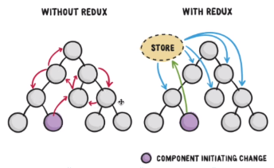
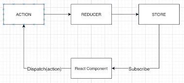

## Redux?
: 상태(state) 관리 라이브러리\
: 리덕스가 없다면 타고타고가서 전해줘야하는데 리덕스가 있으면 바로 알려줄 수 있다!
> a predictable state container


### 🍯꿀팁(Props vs State)
#### Props(Properties의 줄임말)
1. 컴포넌트간에 뭔가를 주고 받을 때 이용
2. 부모컴포넌트에서 자식컴포넌트로만 보낼 수 있다.
3. 부모컴포넌트에서 자식컴포넌트로 보낸 것은 변할 수 없다.
> 바꾸려면 부모컴포넌트에서 바꿔서 보내줘야한다.
``` jsx
<ChatMessages messages={messages} currentMember={member} />
```
#### State
1. 컴포넌트 안에서 데이터를 교환, 전달할 때 사용한다.
2. 변할 수 있기 때문에, 안에서 자유롭게 변경가능.
3. state가 변하면, re-rendering 된다.
``` jsx
state = {
    message: '',
    attachFile: undefined,
    openMenu: false,
};
```
> redux는 이러한 state를 관리해주는 툴이다.

### Redux 데이터 Flow(strict undirectional data flow)
: 한 방향으로만 흐른다.


#### Action
: 객체를 이용
``` jsx
{ type: 'LIKE_ARTICLE', articleId: 42 }
{ type: 'FETCH_USER_SUCCESS', reponse: { id:3, name: 'jun' } }
{ type: 'ADD_TODO', text: 'Read the Redux docs.' }
```

#### Reducer
: state가 action을 통해서 다른 값(?)으로 변했다는 것을 설명해준다.\
=> 이전 state와 action object를 받은 후에 next state를 return한다.
``` jsx
(previousState, action) => nextState
``` 

#### Store
: 어플리케이션의 전체 state을 감싸주는 역할.\
: 많은 method들을 이용해서 state을 관리할 수 있다.

## Redux 세팅하기
### Dependency 다운
1. redux
2. react-redux
#### redux middleware
: redux를 잘 쓸 수 있게 하는 역할.
1. redux-promise\
: dispatch가 promise가 왔을 때 어떻게 대처해야하는지 알려준다.
2. redux-thunk\
: dispatch에게 functions을 받는 방법을 알려준다.
#### 이것들이 왜 필요할까?
: Store 안에 있는 state를 바꿀 수 있는 유일한 방법?\
=> dispatch를 이용해서 action을 통해 바꿀 수 있다.
> action은 객체 형식이다.

but, store는 Promise, Functions 형식을 받기도 하기 때문에 문제가 생긴다.

### Reducer
: 어떻게 state가 변하는가를 보여주고, 변한 마지막 값을 return 해 주는 것.
> 여러가지 state이 있기 때문에 reducer가 다 나누어져 있다.
#### combineReducer
: 이것을 이용해서 Root Reducer에서 여러가지 쪼개져있는 reducer를 한 번에 합쳐준다.
``` js
import { combineReducers } from 'redux';
import user from './user_reducer';
import comment from './comment';

const rootReducer = combineReducers({
    user,
    comment
})
```

### 🍯꿀팁
#### Redux extention
: Redux DevTools를 사용하려면 코드에다가 넣어주어야한다.
``` js
<Provider
    store={ createStoreWithMiddleware(Reducer,
      window.__REDUX_DEVTOOLS_EXTENSION__ &&
      window.__REDUX_DEVTOOLS_EXTENSION__()
      ) }
  >
```
