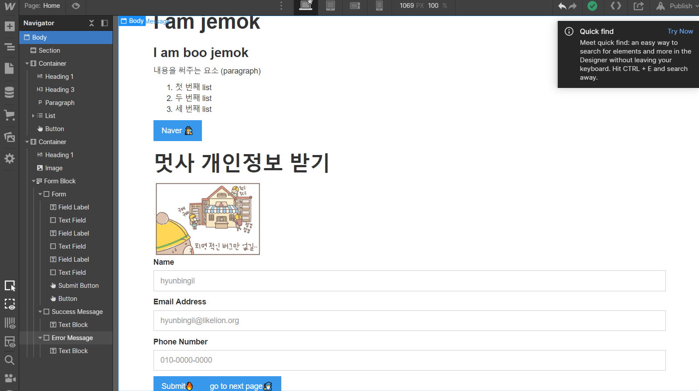
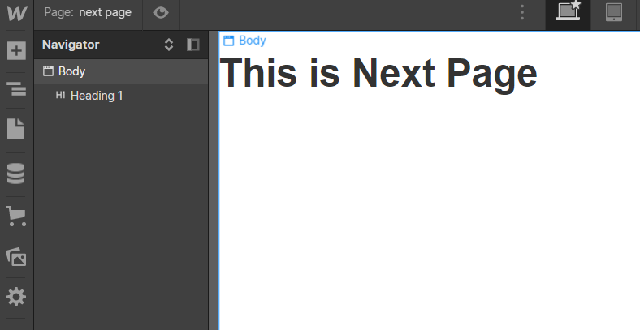

## 환경세팅과 Mockup 기초
### 디지털 노마드(Digital Nomad)
: 여행가서도 일을 할 수 있는 개발자의 삶...이랄까
### 개발자가 가지고 있으면 좋을 소양(신경써주깅)
#### 1. 디버깅 하는 시간을 아까워 하지 말자.
: 해결만 해버리고 넘어가는 경우가 많은데, 그렇게 되면 계속 똑같은 에러를 마주할 수 있으니까 잘 보도록합시당^.^
> 숙달이 되면? 에러를 보고싶은데 못 보는 경우가 생기...ㄹ..수 있다
#### 2. 핑프가 되지 맙시다!
: 코드에 대한 것에 생각도 안해보고 운영진에게 물어보는 경우에 좋지 않은 상황이 생길 수 있으니 자제합시당.
> 구글링하세오.
#### 3. 큰 구조 이해 후 사용하는 습관 기르기
: 개발 자체가 혼자 개발하는 경우도 있지만, 구조를 잘 짜지 못하면 자신의 코드도 못알아보는 경우가 생기니까 조심!\
: 그리고 프로젝트식으로 다른 분들과 코드 공유할 수도 있기 때문에 구조 이해하기!
#### 4. 눈으로만 보기보다는 코드를 쳐봅시당!
: 많이 써봐야 잘 쓸 수 있다!

### 개발환경 세팅하기
1. chrome\
: 기본 브라우저로 설정하기\
: 크롬이 호환성이 굉장히 좋고, 개발자 도구가 있기 때문에 웹 개발에 굉장히 도움이 된다.
2. VSCODE\
: 코드 편집기
3. Git

#### 꿀팁
: Git bash에서 vscode 여는 방법\
```code .```
> 경로 지정해서 여는 거!!!

### 목업(Mockup)이란?
: 추상적인 아이디어를 눈에 보이는 실물 모형으로!\
=> webflow라는 목업 툴을 사용해서 지행할 것이다!
### webflow 사용해서 구조 익히기
https://webflow.com/
1. 제목 h1~ h6
2. 단락 paragraph (container안에 넣어주기)
3. 리스트 (ordered, unordered)
4. 버튼(button) - url, page, section, email, phone-number 등으로 넘겨줄 수 있음.
5. image 넣기\
: height, weight 설정해주기(px 단위)
6. form\
: input을 넣을 때 form안에 넣어야 한다.\
- field label : 공간을 나타내는 꼬리표!
- text field : 어떤 값을 받을 수 있는 곳(?)
> placeholder : 기본값

=> 내용을 입력하고 submit이 되는 곳으로 데이터가 전송된다.

### home


### next page


### 오늘의 수업
: 디자인적인 것 빼고 요소 위주로 설명!

### html 잠깐 맛보기🐱‍🏍
- ```<div> </div>```
: 무난하게 나눠주는 태그